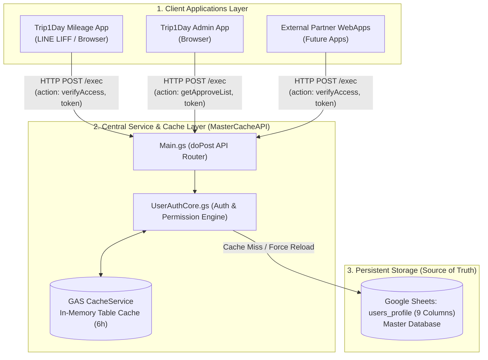
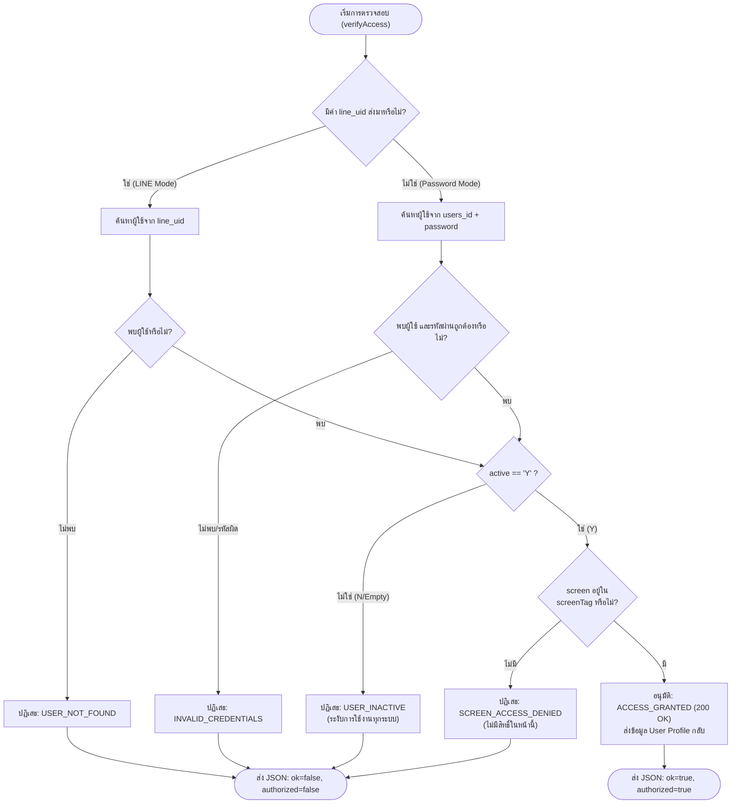
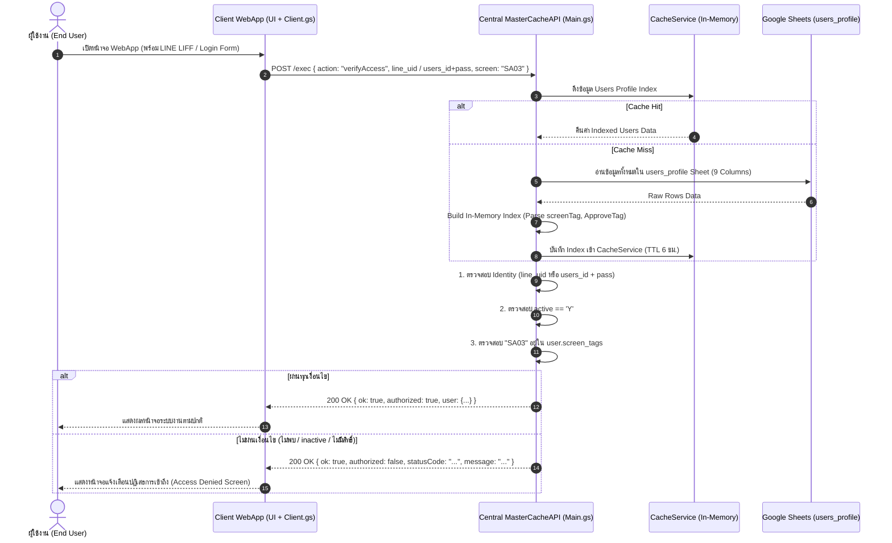
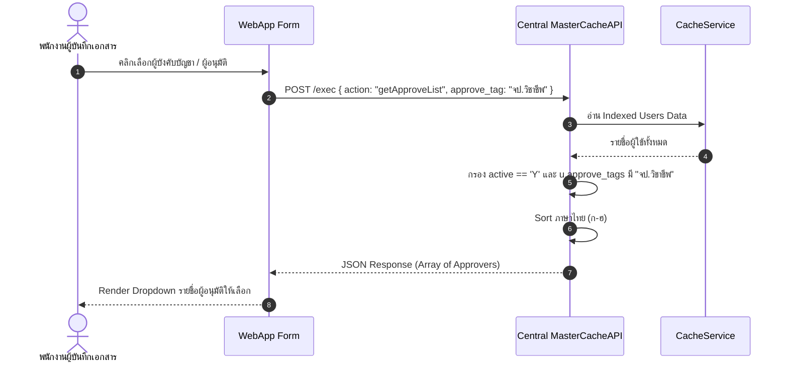

# System Architecture & API Specification: `users_profile` & Access Control Service
**Document ID:** SPEC-IAM-2026-V2.0  
**ระบบงาน:** Central Master-Data & Access Control Service (`MasterCacheAPI / Proxy2u`)  
**สถานะ:** Approved (เอกสารข้อกำหนดเชิงระบบสำหรับทีมพัฒนา)  
**ผู้ออกแบบ / System Analyst:** Enterprise Solutions Architect & System Analyst  
**ผู้ตรวจรับ:** Pingly (System Owner)  
**วันที่จัดทำ:** 2026-09-04  

---

## 1. บทนำและวัตถุประสงค์ของระบบ (Executive Summary & Objectives)

### 1.1 ที่มาและปัญหาเดิม (Background & Problem Statement)
ในปัจจุบันระบบ Web Applications ภายในองค์กร (เช่น *Trip1Day Mileage App*, *Trip1Day Admin*, และระบบงานอื่นๆ ในเครือ) มีการขยายตัวเพิ่มขึ้นอย่างต่อเนื่อง การจัดการข้อมูลผู้ใช้ (User Profile), การตรวจสอบสิทธิ์การเข้าถึงหน้าจอ (Screen Authorization), และการกำหนดรายชื่อผู้อนุมัติ (Approver Workflow) ยังกระจัดกระจาย การใช้โครงสร้างแบบ Matrix หลายคอลัมน์เดิม (`Screen1..10`, `approve_list1..10`) ทำให้ขยายตัวได้ยากและตารางเทอะทะ ระบบจึงปรับมาใช้โครงสร้าง **JSON Tag 9 คอลัมน์ (`screenTag` และ `ApproveTag`)** เพื่อความยืดหยุ่น ประสิทธิภาพสูง และรองรับการเติบโตแบบ Zero Sheet Alteration

### 1.2 วัตถุประสงค์ (System Objectives)
1. **รวมศูนย์การพิสูจน์ตัวตนและกำหนดสิทธิ์ (Centralized Authentication & Authorization):** ให้ระบบ `MasterCacheAPI` ทำหน้าที่เป็น Central Identity & Access Management (IAM) Service เพื่อให้บริการแก่ Web App อื่นๆ ทั้งหมดผ่าน Web Service API
2. **รองรับ Multi-Channel Authentication:** รองรับการยืนยันตัวตนได้ทั้งผ่าน **LINE LIFF (`line_uid`)** แบบ Single Sign-On (SSO) อัตโนมัติ และแบบ **Username/Password (`users_id` + `password`)** กรณีเข้าใช้งานผ่าน Browser ปกติ
3. **ระบบตรวจสอบสิทธิ์ระดับหน้าจอแบบ JSON Tag (`screenTag`):** ตรวจสอบสิทธิ์การเข้าถึงหน้าจอโดยอ้างอิงจาก JSON Array เช่น `["SA03","SA05"]` ไม่จำกัดจำนวนหน้าจอและไม่ต้องเพิ่มคอลัมน์ใหม่
4. **ศูนย์กลางรายชื่อผู้อนุมัติแบบ JSON Tag (`ApproveTag`):** ดึงรายชื่อพนักงานที่มีสิทธิ์อนุมัติตาม Role/Tag ที่ระบุ เช่น `["จป.วิชาชีพ","จป.บริหาร","คุมวงเงินสด","apv.ชดเชยสด"]` หรือรหัสสายงาน เช่น `"SA03"` สำหรับ Lookup Dropdown บนหน้าบันทึกเอกสารของ Web Apps ต่างๆ
5. **High Performance & Zero-Conflict ID Generation:** รองรับการสร้าง `users_id` แบบ High Entropy O(1) โดยไม่ต้อง count แถวเดิม หรืออ่านข้อมูลเก่าใน Sheet เพื่อป้องกันปัญหา Concurrency Race Condition และ Latency

---

## 2. โครงสร้างฐานข้อมูล (Database Schema: `users_profile`)

ตาราง `users_profile` ถูกจัดเก็บเป็น Google Sheet ภายใต้ Central Master Spreadsheet ของระบบ ประกอบด้วย **9 คอลัมน์หลัก (Column A ถึง I)**

### 2.1 Data Dictionary (พจนานุกรมข้อมูล)

| ลำดับ | Column | ชื่อฟิลด์ (Column Name) | ชนิดข้อมูล (Data Type) | Nullable | รูปแบบ / ตัวอย่างค่า | ค่าเริ่มต้น (Default) | คำอธิบายทางธุรกิจ (Business Definition) & กฎเกณฑ์ (Rules) |
|:---:|:---:|---|---|:---:|---|:---:|---|
| 1 | **A** | `users_id` | `VARCHAR(32)` (Text) | **NO (PK)** | `usr_m3k9xfk_7a9b2c` | Generated | รหัสผู้ใช้งานหลัก (Primary Key) ไม่ซ้ำกันในระบบ **ห้ามใช้สูตร Count แถว** (สร้างแบบ O(1)) |
| 2 | **B** | `password` | `VARCHAR(128)` (Text) | **NO** | Plaintext / Hashed String | - | รหัสผ่านสำหรับ Login เข้าสู่ระบบ |
| 3 | **C** | `users_name` | `VARCHAR(100)` (Text) | **NO** | ภาษาไทย / อังกฤษ | - | ชื่อ-นามสกุล ของพนักงาน (บันทึกตอนลงทะเบียน) |
| 4 | **D** | `line_uid` | `VARCHAR(64)` (Text) | YES | `U1234567890abcdef...` (ยาว 33 ตัวอักษร) | `""` | LINE UID ที่ผูกกับบัญชีผู้ใช้เมื่อเข้าใช้งานผ่าน LINE LIFF |
| 5 | **E** | `emp_no` | `VARCHAR(20)` (Text) | YES | `EMP00124` | `""` | รหัสประจำตัวพนักงาน |
| 6 | **F** | `email` | `VARCHAR(100)` (Text) | YES | `user@domain.com` | `""` | อีเมลสำหรับติดต่อหรือรับการแจ้งเตือน |
| 7 | **G** | `active` | `CHAR(1)` (Enum) | **NO** | `'Y'`, `'N'` | `'N'` | สถานะบัญชี: `'Y'` = มีสิทธิ์ใช้งาน, `'N'` = ระงับสิทธิ์ทุกระบบทันที |
| 8 | **H** | `screenTag` | `TEXT` (JSON Array) | **NO** | `["SA03","SA05"]` | `[]` | รายการรหัสหน้าจอที่ผู้ใช้มีสิทธิ์เข้าใช้งาน |
| 9 | **I** | `ApproveTag` | `TEXT` (JSON Array) | **NO** | `["จป.วิชาชีพ","จป.บริหาร","คุมวงเงินสด","apv.ชดเชยสด"]` | `[]` | รายการบทบาท/กลุ่มงานที่ผู้ใช้สามารถอนุมัติได้ |

---

### 2.2 กฎการสร้างรหัสผู้ใช้แบบ High-Entropy (Primary Key Generation Algorithm)

> [!IMPORTANT]
> **ข้อกำหนดสำคัญด้านประสิทธิภาพและ Concurrency:**  
> ห้ามใช้ `sheet.getLastRow() + 1` หรือการนับจำนวนแถวเก่า เพราะทำให้เกิด Race Condition เมื่อมีการลงทะเบียนพร้อมกัน และช้าเนื่องจากต้องอ่าน Sheet ทั้งหมดก่อนบันทึก

**อัลกอริทึมการสร้าง `users_id` (O(1) Time Complexity):**
$$\text{users\_id} = \text{"usr\_"} + \text{Base36(Timestamp)} + \text{"\_"} + \text{CryptoRandom(6)}$$

*ตัวอย่าง:*
- Timestamp ปัจจุบัน: `1756634892104` $\rightarrow$ Base36: `m3k9xfk`
- Random Salt (6 ตัวอักษร): `7a9b2c`
- ผลลัพธ์: `usr_m3k9xfk_7a9b2c`

```javascript
/**
 * ฟังก์ชันสร้าง Primary Key users_id แบบ O(1) ไม่ต้องอ่าน Sheet
 * @returns {string} เช่น "usr_m3k9xfk_7a9b2c"
 */
function generateUserId() {
  var timePart = new Date().getTime().toString(36);
  var randomPart = Math.random().toString(36).substring(2, 8);
  return 'usr_' + timePart + '_' + randomPart;
}
```

---

### 2.3 การจัดการและ Parse JSON Tag อย่างปลอดภัย (Safe JSON Tag Parsing)

เนื่องจากคอลัมน์ H (`screenTag`) และ I (`ApproveTag`) ถูกกรอกใน Google Sheet โค้ดฝั่ง Server ต้องรองรับทั้งรูปแบบ JSON Array มาตรฐาน และการพิมพ์คั่นด้วยเครื่องหมายจุลภาค (Comma Fallback) เพื่อป้องกันกรณีข้อมูล Error จากผู้ใช้งานกรอก:

```javascript
/**
 * Parse JSON tag text เป็น string array อย่างปลอดภัย
 * @param {string|Array} val
 * @returns {string[]}
 */
function parseJsonTags(val) {
  if (!val) return [];
  if (Array.isArray(val)) return val;
  var str = String(val).trim();
  if (!str) return [];
  try {
    var parsed = JSON.parse(str);
    if (Array.isArray(parsed)) {
      return parsed.map(function(item) { return String(item).trim(); }).filter(Boolean);
    }
  } catch (e) {
    // Fallback กรณีไม่ได้ใส่ JSON เช่นพิมพ์ "SA03, SA05"
  }
  return str.split(',').map(function(item) {
    return item.replace(/[\[\]"']/g, '').trim();
  }).filter(Boolean);
}
```

---

## 3. สถาปัตยกรรมระบบและการทำงานร่วมกับ MasterCacheAPI (System Architecture)



### 3.1 กลยุทธ์การ Cache สำหรับข้อมูล User Profile & Permission

เพื่อให้ระบบตอบสนองได้เร็วระดับ Sub-second สำหรับทุก Web App:
1. **Table In-Memory Indexing:** ฝั่ง Central API จะโหลดตาราง `users_profile` มาเก็บใน `CacheService` เป็นก้อน Index Object:
   - `byLineUid`: Map สำหรับค้นหาด้วย `line_uid` (O(1) Lookup)
   - `byUserId`: Map สำหรับค้นหาด้วย `users_id` (O(1) Lookup)
   - `users`: Array ของรายการผู้ใช้ทั้งหมดพร้อมฟิลด์ `screen_tags: []` และ `approve_tags: []` ที่ Parse แล้ว
2. **Cache Invalidation & Real-Time Sync:**
   - TTL สูงสุด 6 ชั่วโมง (ตามมาตรฐานของโปรเจกต์ `Proxy2u`)
   - มี Action `clearCache` (หรือ trigger ตอน Admin แก้ไขข้อมูล) เพื่อล้างแคชทันที
   - สนับสนุนพารามิเตอร์ `forceFresh: true` เพื่อบังคับอ่านจาก Google Sheet โดยตรงเมื่อต้องการความถูกต้อง 100%

---

## 4. ข้อกำหนด API (API Contract Specifications)

ทุก Request ส่งผ่าน HTTP `POST` มาที่ Web App URL ของ Central API  
Content-Type: `application/json`

---

### 4.1 Service 1: การตรวจสอบสิทธิ์และยืนยันตัวตน (`action: "verifyAccess"`)

ใช้สำหรับตรวจสิทธิ์ผู้ใช้ก่อนเปิดหน้าจอ หรือก่อนอนุญาตให้ Web App ดำเนินการใดๆ

#### 4.1.1 ลำดับความสำคัญในการตรวจสอบ (Authentication & Authorization Logic Hierarchy):



#### 4.1.2 Request Specification:
```json
{
  "action": "verifyAccess",
  "token": "SHARED_SECRET_TOKEN_HERE",
  "datasetKey": "users_profile",
  "line_uid": "U1234567890abcdef1234567890abcdef",
  "users_id": "usr_m3k9xfk_7a9b2c",
  "password": "mySecurePassword123",
  "screen": "SA03",
  "forceFresh": false
}
```

**คำอธิบายฟิลด์ใน Request:**
- `action` *(string, required)*: ต้องเป็น `"verifyAccess"`
- `token` *(string, required)*: Shared-Secret Token สำหรับความปลอดภัยระหว่าง Server-to-Server
- `datasetKey` *(string, optional)*: ระบุ `"users_profile"` (default: `"users_profile"`)
- `line_uid` *(string, optional)*: ส่งมาเมื่อเข้าผ่าน LINE LIFF (หากมีค่า ระบบจะเช็คค่านี้เป็นลำดับแรก โดยไม่สนใจ `users_id` และ `password`)
- `users_id` *(string, optional)*: รหัสผู้ใช้ (จำเป็นเมื่อไม่ได้ส่ง `line_uid`)
- `password` *(string, optional)*: รหัสผ่าน (จำเป็นเมื่อไม่ได้ส่ง `line_uid`)
- `screen` *(string, required)*: รหัสหน้าจอที่ต้องการเข้าใช้งาน เช่น `"SA03"` หรือ `"SA05"` (รองรับพารามิเตอร์ `screen_tag` หรือ `screen_id` ด้วย)
- `forceFresh` *(boolean, optional)*: `true` = บังคับโหลดใหม่จาก Sheet ข้าม Cache

#### 4.1.3 Response Specification (กรณีผ่านการอนุมัติ - Success):
```json
{
  "ok": true,
  "authorized": true,
  "statusCode": "ACCESS_GRANTED",
  "message": "Access granted successfully",
  "user": {
    "users_id": "usr_m3k9xfk_7a9b2c",
    "users_name": "สมชาย มุ่งมั่น",
    "emp_no": "EMP0088",
    "email": "somchai.m@company.com",
    "line_uid": "U1234567890abcdef1234567890abcdef",
    "active": "Y",
    "screen_tags": ["SA03", "SA05"],
    "approve_tags": ["จป.วิชาชีพ", "จป.บริหาร", "คุมวงเงินสด"]
  }
}
```

#### 4.1.4 Response Specification (กรณีปฏิเสธการเข้าถึง - Denial / Error Matrix):

| สาเหตุการปฏิเสธ (Scenario) | `ok` | `authorized` | `statusCode` | `message` (คำอธิบาย) |
|---|:---:|:---:|---|---|
| ไม่พบ LINE UID ในระบบ | `true` | `false` | `USER_NOT_FOUND` | `"User not found with the provided LINE UID"` |
| ไม่พบ `users_id` หรือรหัสผ่านไม่ถูกต้อง | `true` | `false` | `INVALID_CREDENTIALS` | `"Invalid users_id or password"` |
| ผู้ใช้งานถูกระงับสิทธิ์ (`active != 'Y'`) | `true` | `false` | `USER_INACTIVE` | `"User account is inactive or disabled"` |
| ไม่มีสิทธิ์ในหน้าจอที่ระบุ (ไม่อยู่ใน `screenTag`) | `true` | `false` | `SCREEN_ACCESS_DENIED` | `"Access denied for Screen: SA03"` |
| ไม่ได้ระบุรหัสหน้าจอ | `true` | `false` | `INVALID_SCREEN_ID` | `"Screen identifier is required"` |
| Token ตรวจสอบ API ไม่ถูกต้อง | `false` | `false` | `INVALID_TOKEN` | `"Unauthorized: Invalid shared token"` |

*ตัวอย่าง Denial Payload:*
```json
{
  "ok": true,
  "authorized": false,
  "statusCode": "SCREEN_ACCESS_DENIED",
  "message": "Access denied for Screen: SA03",
  "user": {
    "users_id": "usr_m3k9xfk_7a9b2c",
    "users_name": "สมชาย มุ่งมั่น",
    "active": "Y"
  }
}
```

---

### 4.2 Service 2: การดึงรายชื่อผู้อนุมัติ (`action: "getApproveList"`)

ใช้สำหรับดึงรายชื่อพนักงานที่มีสิทธิ์อนุมัติตาม Tag หรือ Role ที่ระบุ เพื่อนำไปแสดงผลใน Dropdown / Lookup บน Web App ต่างๆ

#### 4.2.1 เงื่อนไขการกรองข้อมูล (Filtering Business Rules):
1. ผู้ใช้งานต้องมีสถานะเปิดใช้งานอยู่จริง (`active == 'Y'`)
2. คอลัมน์ `ApproveTag` ต้องมี Tag ที่ตรงกับที่ส่งมา เช่น `"SA03"` หรือ `"จป.วิชาชีพ"`
3. เรียงลำดับรายชื่อตามตัวอักษรภาษาไทย (`localeCompare('th')`)
4. คืนค่าเฉพาะฟิลด์ที่จำเป็นต่อการแสดงผลและส่งต่อการแจ้งเตือน (`users_id`, `users_name`, `line_uid`, `emp_no`, `email`)

#### 4.2.2 Request Specification:
```json
{
  "action": "getApproveList",
  "token": "SHARED_SECRET_TOKEN_HERE",
  "datasetKey": "users_profile",
  "approve_tag": "จป.วิชาชีพ",
  "forceFresh": false
}
```

**คำอธิบายฟิลด์ใน Request:**
- `action` *(string, required)*: ต้องเป็น `"getApproveList"`
- `token` *(string, required)*: Shared-Secret Token
- `approve_tag` *(string, required)*: Tag หรือกลุ่มผู้อนุมัติ เช่น `"จป.วิชาชีพ"`, `"apv.ชดเชยสด"` หรือ `"SA03"` (รองรับพารามิเตอร์ `tag`, `screen` หรือ `approve_id` ด้วย)
- `forceFresh` *(boolean, optional)*: `true` = บังคับโหลดใหม่จาก Sheet ข้าม Cache

#### 4.2.3 Response Specification (สำเร็จ - Success):
```json
{
  "ok": true,
  "approve_tag": "จป.วิชาชีพ",
  "count": 2,
  "source": "cache",
  "data": [
    {
      "users_id": "usr_m3k9xfk_7a9b2c",
      "users_name": "กิตติศักดิ์ เจริญพร",
      "line_uid": "U9876543210fedcba9876543210fedcba",
      "emp_no": "MGR001",
      "email": "kittisak.c@company.com"
    },
    {
      "users_id": "usr_m3k9xfk_8c1e4d",
      "users_name": "จิราพร วงศ์สุวรรณ",
      "line_uid": "Uabcdef1234567890abcdef1234567890",
      "emp_no": "MGR005",
      "email": "jiraporn.w@company.com"
    }
  ]
}
```

---

### 4.3 Service 3: การลงทะเบียนและบันทึกผู้ใช้ใหม่ (`action: "registerUser"`)

สำหรับกรณีหน้าจอลงทะเบียน (Registration Form) ต้องการส่งข้อมูลมาสร้างผู้ใช้ใหม่

#### 4.3.1 Request Specification:
```json
{
  "action": "registerUser",
  "token": "SHARED_SECRET_TOKEN_HERE",
  "datasetKey": "users_profile",
  "data": {
    "password": "InitialPassword123",
    "users_name": "ประสิทธิ์ มั่งคั่ง",
    "emp_no": "EMP0155",
    "email": "prasit.m@company.com",
    "line_uid": "U44556677889900aabbccddeeff112233",
    "screenTag": ["SA03"],
    "ApproveTag": []
  }
}
```

#### 4.3.2 Logic & Workflow:
1. ระบบทำการ Generate `users_id` ทันทีด้วย `generateUserId()` แบบ O(1)
2. กำหนดค่าเริ่มต้น `active = 'N'` (รอ Admin อนุมัติสิทธิ์) และกำหนด `screenTag = '[]'`, `ApproveTag = '[]'` (หรือบันทึกตามค่าเริ่มต้นที่ส่งมา)
3. ทำการ `sheet.appendRow([...])` โดยตรง (9 คอลัมน์)
4. สั่ง Invalidate Cache ของ `users_profile`

#### 4.3.3 Response Specification:
```json
{
  "ok": true,
  "message": "User registered successfully",
  "users_id": "usr_m3k9xfk_5e2d1a"
}
```

---

## 5. แผนผังกระบวนการทำงาน (Sequence & Flow Diagrams)

### 5.1 End-to-End Authentication & Authorization Sequence



---

### 5.2 Approver Lookup Sequence



---

## 6. โครงสร้างการตั้งค่าในโปรเจกต์ (`DatasetConfigs.gs`)

Configuration สำหรับตาราง `users_profile` ใน `DatasetConfigs.gs`:

```javascript
// DatasetConfigs.gs
const DATASET_CONFIGS = {
  site: {
    datasetKey: 'site',
    spreadsheetId: '1CNTlNGn7w5rRDWundhnNgFaUII9kQvAEBUmWe0lpWGw',
    sheetName: 'Master_Site',
    valueColumn: 'B',
    activeColumn: 'C',
    serverTtlSec: 21600,
    schemaVersion: 1
  },
  
  // ==================== DATASET USERS PROFILE (JSON TAG ARCHITECTURE) ====================
  users_profile: {
    datasetKey: 'users_profile',
    spreadsheetId: '1ph7UYaV25wIkk_Qq61O_axobu5ID0j4wDGDObamcBRM', // หรือ ID ของ Sheet ที่เก็บ User
    sheetName: 'users_profile',
    serverTtlSec: 21600,       // แคช 6 ชั่วโมง
    schemaVersion: 2           // Schema Version 2 (JSON Tag)
  }
};
```

---

## 7. ข้อกำหนดด้านความปลอดภัยและมาตรฐานการปฏิบัติงาน (Security & Best Practices)

1. **การป้องกัน Shared Token รั่วไหล:**
   - เก็บ Token ไว้ใน `Script Properties` ของ Google Apps Script ทั้งฝั่ง Client และ Central Server เสมอ
   - ห้าม Hardcode Token ลงใน Source Code ฝั่ง Client Browser (`cache-client.html`)
2. **การเข้ารหัสและจัดเก็บ Password:**
   - แนะนำให้จัดเก็บ Password ในรูปแบบ SHA-256 Hash เพื่อความปลอดภัย
   - ในกรณีที่ระบบเริ่มต้นยังใช้ Plaintext ควรกำหนดขั้นตอน Migration ให้รองรับ Hash ใน Phase ถัดไป
3. **การตรวจสอบ LINE UID Spoofing:**
   - ฝั่ง Client WebApp เมื่อดึง `line_uid` จาก `liff.getProfile()` หรือ `liff.getDecodedIDToken()` ควรส่งผ่าน Server-side wrapper เพื่อยืนยันความถูกต้อง
4. **Data Sanitization & Trimming:**
   - ข้อมูล Text ทั้งหมดที่อ่านจาก Sheet หรือรับจาก Request ต้องผ่านการ `.trim()` และตรวจสอบ Type เสมอเพื่อป้องกันข้อผิดพลาดจากช่องว่าง (Whitespace)

---

## 8. ตารางกรณีทดสอบและเกณฑ์การตรวจรับ (Test Cases & Acceptance Criteria)

| Test Case ID | วัตถุประสงค์การทดสอบ | ข้อมูลนำเข้า (Input Payload) | ข้อมูลใน Sheet จำลอง | ผลลัพธ์ที่คาดหวัง (Expected Output) | สถานะ |
|:---:|---|---|---|---|:---:|
| **TC-AUTH-01** | ตรวจสอบผ่านด้วย LINE UID สำเร็จ | `line_uid: "U1111"`, `screen: "SA03"` | `line_uid: "U1111"`, `active: "Y"`, `screenTag: ["SA03","SA05"]` | `ok: true, authorized: true, statusCode: "ACCESS_GRANTED"` | [ ] |
| **TC-AUTH-02** | ตรวจสอบผ่านด้วย `users_id` + `password` | `users_id: "usr_01"`, `password: "pass123"`, `screen: "SA05"` | `users_id: "usr_01"`, `password: "pass123"`, `active: "Y"`, `screenTag: ["SA05"]` | `ok: true, authorized: true, statusCode: "ACCESS_GRANTED"` | [ ] |
| **TC-AUTH-03** | ผู้ใช้ถูกระงับสิทธิ์ (`active = 'N'`) | `line_uid: "U2222"`, `screen: "SA03"` | `line_uid: "U2222"`, `active: "N"`, `screenTag: ["SA03"]` | `ok: true, authorized: false, statusCode: "USER_INACTIVE"` | [ ] |
| **TC-AUTH-04** | ไม่มีสิทธิ์ในหน้าจอที่ระบุ (ไม่อยู่ใน `screenTag`) | `line_uid: "U1111"`, `screen: "SA01"` | `line_uid: "U1111"`, `active: "Y"`, `screenTag: ["SA03","SA05"]` | `ok: true, authorized: false, statusCode: "SCREEN_ACCESS_DENIED"` | [ ] |
| **TC-AUTH-05** | รหัสผ่านไม่ถูกต้อง | `users_id: "usr_01"`, `password: "wrongpass"`, `screen: "SA03"` | `users_id: "usr_01"`, `password: "pass123"`, `active: "Y"` | `ok: true, authorized: false, statusCode: "INVALID_CREDENTIALS"` | [ ] |
| **TC-AUTH-06** | ไม่พบข้อมูลผู้ใช้ในระบบ | `line_uid: "U9999_NOT_FOUND"`, `screen: "SA03"` | ไม่มีในตาราง | `ok: true, authorized: false, statusCode: "USER_NOT_FOUND"` | [ ] |
| **TC-AUTH-07** | กรณีส่งทั้ง LINE UID และ User/Pass | `line_uid: "U1111"`, `users_id: "usr_WRONG"`, `screen: "SA03"` | `line_uid: "U1111"`, `active: "Y"`, `screenTag: ["SA03"]` | `ok: true, authorized: true` *(ให้สิทธิ์ LINE UID ก่อน)* | [ ] |
| **TC-APPV-01** | ดึงรายชื่อผู้อนุมัติด้วย Tag สำเร็จ | `approve_tag: "จป.วิชาชีพ"` | มี 3 คนที่ `active="Y"` และมี `"จป.วิชาชีพ"` ใน `ApproveTag` | `ok: true, count: 3, data: [3 users]` | [ ] |
| **TC-APPV-02** | ดึงรายชื่อผู้อนุมัติด้วยรหัสหน้าจอ/สายงาน | `approve_tag: "SA03"` | มีผู้ใช้ที่มี `"SA03"` ใน `ApproveTag` | `ok: true, approve_tag: "SA03", data: [...]` | [ ] |
| **TC-APPV-03** | ผู้อนุมัติที่ `active="N"` ต้องไม่ติดมา | `approve_tag: "จป.บริหาร"` | 1 คน `active="N"`, 1 คน `active="Y"` ที่มี Tag | `ok: true, count: 1` *(ไม่แสดงคนที่ Inactive)* | [ ] |
| **TC-GEN-01** | สร้าง `users_id` ซ้ำกัน 10,000 ครั้ง | รัน `generateUserId()` ใน Loop | - | ทุกค่าต้อง Unique 100% ไม่ซ้ำกันเลย | [ ] |

---

## 9. สรุปขั้นตอนการดำเนินงานสำหรับทีมพัฒนา (Implementation Roadmap)

1. **Phase 1: Database Setup**
   - สร้าง Sheet `users_profile` ใน Google Spreadsheet 9 คอลัมน์ (A–I) ตาม Data Dictionary ข้อ 2.1
   - ใส่ข้อมูลตัวอย่าง (Dummy Data) เช่น `screenTag` = `["SA03","SA05"]`, `ApproveTag` = `["จป.วิชาชีพ","จป.บริหาร"]`
2. **Phase 2: Central API Enhancement**
   - อัปเดต `DatasetConfigs.gs` (Schema Version 2)
   - อัปเดต `UserAuthCore.gs` ให้ใช้ Safe JSON Tag Parser, `screenTag` Check, และ `ApproveTag` Filtering
   - ปรับ Route `verifyAccess` และ `getApproveList` ใน `Main.gs`
3. **Phase 3: Client Wrapper Implementation**
   - เรียกใช้งานผ่าน `verifyAccess` (ส่ง `screen: "SA03"`) และ `getApproveList` (ส่ง `approve_tag: "..."`)
4. **Phase 4: Testing & Deployment**
   - ดำเนินการทดสอบตาม Test Matrix ข้อ 8
   - Deploy Version ใหม่ของ Web App
